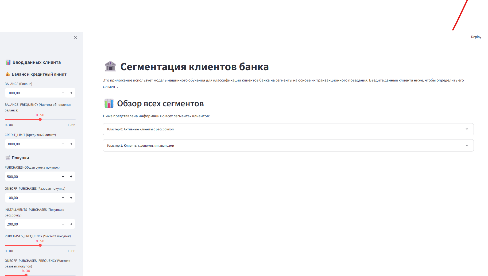
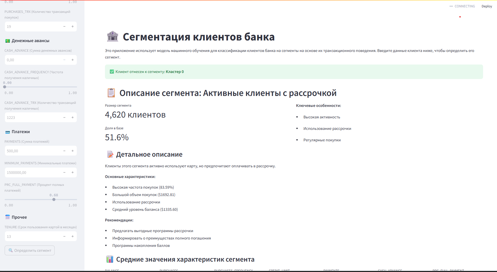

# Сегментация клиентов банка

[](https://github.com/BeketML/credit_card_project)

Проект по разработке интерактивного сервиса для сегментации клиентов банка на основе их транзакционного поведения с использованием методов машинного обучения.

**Репозиторий**: [https://github.com/BeketML/credit_card_project](https://github.com/BeketML/credit_card_project)

## Описание проекта

Этот проект представляет собой end-to-end решение для автоматической сегментации клиентов банка. Он включает:

- **Аналитическую часть**: Jupyter notebook с полным анализом данных, предобработкой и обучением модели кластеризации K-Means
- **Интерактивную часть**: Веб-приложение на Streamlit для классификации новых клиентов в реальном времени

**Цель проекта**: Помочь банкам лучше понимать своих клиентов, чтобы предлагать персонализированные продукты, оптимизировать маркетинговые стратегии и управлять рисками.

## Структура проекта

```
credit_card_project/
├── data/
│   └── CC GENERAL.csv              # Исходные данные о клиентах
├── models/
│   ├── scaler.joblib               # Сохраненный StandardScaler/MinMaxScaler
│   ├── pca_model.joblib            # Сохраненная модель PCA
│   └── kmeans_model.joblib         # Сохраненная модель K-Means
├── images/
│   ├── streamlit_interface.png     # Скриншот интерфейса приложения
│   └── streamlit_result.png        # Скриншот результата классификации
├── first_project.ipynb             # Jupyter notebook с анализом и обучением
├── streamlit_app.py                # Streamlit веб-приложение
├── requirements.txt                # Зависимости проекта
└── README.md                       # Этот файл
```

## Набор данных

- **Источник**: Kaggle - Credit Card Dataset for Clustering
- **Описание**: Набор данных содержит обезличенную информацию о ~9000 клиентах банка
- **Признаки**: 18 поведенческих метрик (баланс, частота покупок, использование кредитного лимита и т.д.)

## Технологии

- **Python 3.x**
- **Pandas** - работа с данными
- **NumPy** - численные вычисления
- **Scikit-learn** - машинное обучение (K-Means, PCA, StandardScaler)
- **Streamlit** - веб-интерфейс
- **Matplotlib, Seaborn** - визуализация
- **Joblib** - сохранение моделей

## Установка и настройка

### 1. Клонирование репозитория

```bash
git clone https://github.com/BeketML/credit_card_project.git
cd credit_card_project
```

### 2. Создание виртуального окружения

**Windows:**
```bash
python -m venv venv
venv\Scripts\activate
```

**Linux/Mac:**
```bash
python3 -m venv venv
source venv/bin/activate
```

### 3. Установка зависимостей

```bash
pip install -r requirements.txt
```

## Запуск приложения

### Запуск Streamlit приложения

```bash
streamlit run streamlit_app.py
```

Приложение откроется в браузере по адресу `http://localhost:8501`

### Запуск Jupyter notebook

```bash
jupyter notebook first_project.ipynb
```

## Использование

### Streamlit приложение

1. Откройте приложение в браузере после запуска команды `streamlit run streamlit_app.py`
2. В боковой панели введите данные клиента:
   - **Баланс и кредитный лимит**: BALANCE, BALANCE_FREQUENCY, CREDIT_LIMIT
   - **Покупки**: PURCHASES, ONEOFF_PURCHASES, INSTALLMENTS_PURCHASES, и другие параметры покупок
   - **Денежные авансы**: CASH_ADVANCE, CASH_ADVANCE_FREQUENCY, CASH_ADVANCE_TRX
   - **Платежи**: PAYMENTS, MINIMUM_PAYMENTS, PRC_FULL_PAYMENT
   - **Прочее**: TENURE (срок пользования картой)
3. Нажмите кнопку "Определить сегмент"
4. Просмотрите результат классификации и описание сегмента клиента

### Jupyter notebook

Notebook содержит полный цикл анализа данных:

1. Загрузка и исследование данных
2. Предобработка (обработка пропусков, логарифмическое преобразование)
3. Масштабирование признаков (StandardScaler/MinMaxScaler)
4. Снижение размерности (PCA)
5. Кластеризация (K-Means)
6. Визуализация результатов
7. Сохранение моделей

## Примеры работы приложения

Ниже представлены скриншоты интерактивного веб-приложения Streamlit для сегментации клиентов банка.

> **Примечание**: Для отображения изображений в README необходимо поместить скриншоты в папку `images/` с именами `streamlit_interface.png` и `streamlit_result.png`

### Интерфейс приложения



На первом скриншоте видно:
- **Левая панель ("Ввод данных клиента")**: Содержит поля для ввода различных финансовых показателей клиента, таких как баланс, кредитный лимит, суммы и частоты покупок (включая разовые и в рассрочку). Для некоторых показателей используются слайдеры для удобного ввода значений.
- **Основная область**:
  - Заголовок "Сегментация клиентов банка" и краткое описание функционала приложения
  - Раздел "Обзор всех сегментов", где перечислены обнаруженные кластеры клиентов с их краткими описаниями. В данном случае показаны "Кластер 0: Активные клиенты с рассрочкой" и "Кластер 1: Клиенты с денежными авансами"

### Результат классификации



На втором скриншоте показан результат работы приложения после ввода данных клиента:
- **Результат классификации**: Клиент отнесен к сегменту "Кластер 0"
- **Описание сегмента**: "Активные клиенты с рассрочкой"
- **Статистика сегмента**: Размер сегмента (4,620 клиентов, 51.6% базы)
- **Ключевые особенности**: Высокая активность, использование рассрочки, регулярные покупки
- **Детальное описание**: Полная характеристика сегмента с основными показателями и рекомендациями для работы с клиентами этого типа
- **Средние значения характеристик**: Отображение ключевых метрик сегмента

## Описание кластеров

Модель разделяет клиентов на **2 основных сегмента**:

### Кластер 0
- **Характеристики**: Определяются на основе анализа данных
- **Особенности**: Зависят от паттернов поведения клиентов

### Кластер 1
- **Характеристики**: Определяются на основе анализа данных
- **Особенности**: Зависят от паттернов поведения клиентов

Детальное описание каждого кластера автоматически генерируется в Streamlit приложении на основе анализа средних значений признаков.

## Методология

### Предобработка данных

1. Удаление идентификаторов клиентов
2. Обработка пропущенных значений:
   - Удаление строк с пропущенным CREDIT_LIMIT
   - Заполнение MINIMUM_PAYMENTS медианой
3. Логарифмическое преобразование для 12 признаков (для нормализации распределения)
4. Масштабирование признаков (MinMaxScaler/StandardScaler)
5. Снижение размерности с помощью PCA (сохранение 95% дисперсии)

### Алгоритм кластеризации

- **K-Means** с определением оптимального числа кластеров методом локтя и коэффициентом силуэта
- Используется 2 кластера (K=2)

## Результаты

Модель успешно разделяет клиентов на сегменты на основе их транзакционного поведения, что позволяет:

- Персонализировать маркетинговые кампании
- Оптимизировать предложения продуктов
- Управлять кредитными рисками
- Улучшать качество обслуживания клиентов

## Авторы

Проект разработан в рамках изучения методов машинного обучения и развертывания моделей.

## Лицензия

Этот проект создан в образовательных целях.

